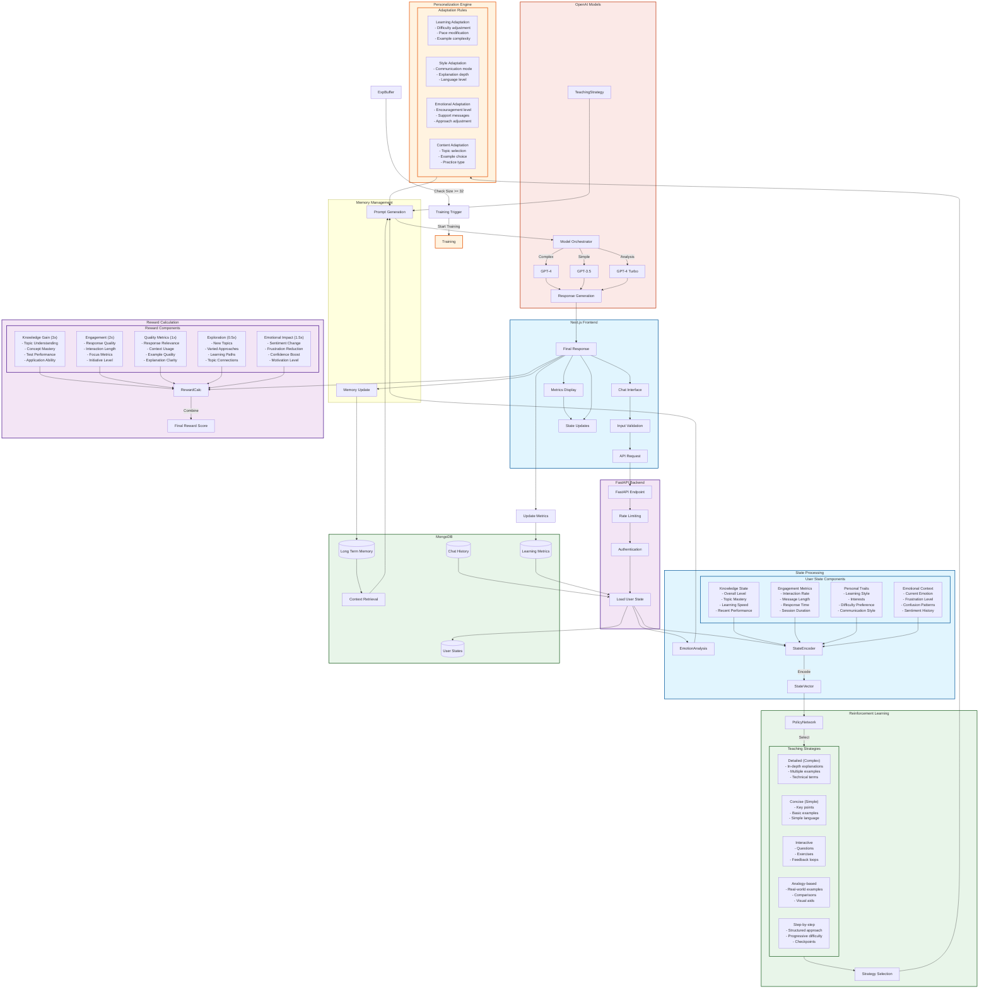

# Complete System Architecture Flow



## Complete Flow Description

1. **Frontend Interaction**
   - User interacts with Next.js chat interface
   - Input validated and formatted
   - API request sent to backend
   - Real-time metrics display updated

2. **API Layer Processing**
   - FastAPI receives request
   - Rate limiting and auth checks
   - User state loaded from MongoDB

3. **State Processing**
   - Emotion analysis performed
   - State encoded into 10D vector
   - Current context retrieved

4. **Database Integration**
   - User states managed
   - Chat history stored
   - Metrics tracked
   - Long-term memory maintained

5. **RL Decision Making**
   - Policy network evaluates state
   - Teaching strategy selected
   - Experience collected for training

6. **OpenAI Integration**
   - Prompt generated with context
   - Appropriate model selected
   - Response generated

7. **Response Processing**
   - Response sent to frontend
   - State updated
   - Metrics calculated
   - Memory updated

8. **Training Loop**
   - Experience buffer checked
   - PPO training triggered at threshold
   - Policy network updated
   - Continuous improvement cycle

9. **Metrics and Analytics**
   - Learning metrics updated
   - Performance tracked
   - User state persisted
   - Frontend displays updated

## Detailed Technical Flow

1. **Frontend Components (Next.js)**
   - `ChatInterface.tsx` manages real-time chat state and messages array
   - WebSocket connection maintains live metrics updates
   - Input preprocessing includes:
     - Message sanitization
     - Context aggregation
     - User session tracking
   - Metrics visualization using Recharts for:
     - Learning progress
     - Engagement levels
     - Topic mastery radar charts

2. **API Layer (FastAPI)**
   - Rate limiting: 60 requests/minute per user
   - Authentication using JWT tokens
   - Request validation through Pydantic models:
     ```python
     ChatRequest(message: str, user_id: str)
     ChatResponse(response: str, teaching_strategy: dict, metrics: dict)
     ```
   - Asynchronous endpoint handling with error recovery

3. **State Management**
   - Emotion Detection:
     - VADER sentiment analysis
     - Pattern matching for confusion/frustration
     - Emotional trend tracking
   - State Vector Components:
     ```python
     state_vector = [
         knowledge_level,      # Overall learning progress (0-1)
         recent_performance,   # Last 5 interactions score
         topic_mastery,       # Average across topics
         engagement,          # Current session engagement
         interaction_freq,    # Normalized interaction rate
         interest_diversity,  # Unique topics coverage
         response_length,     # Normalized message length
         complexity_pref,     # Preferred difficulty level
         learning_speed,      # Knowledge gain rate
         interaction_style    # Q&A vs discussion preference
     ]
     ```

4. **Memory System**
   - Long-term memory using embedding similarity search
   - Context retrieval based on:
     - Semantic similarity (cosine distance)
     - Temporal relevance
     - Emotional significance
   - Memory consolidation through periodic pruning
   - Importance scoring algorithm:
     ```python
     importance = base_score * age_factor + 
                 emotion_boost + repetition_boost
     ```

5. **RL Components**
   - Policy Network Architecture:
     ```python
     PolicyNetwork(
         input_size=10,  # State dimensions
         hidden_layers=[64, 32],
         output_size=5   # Teaching strategies
     )
     ```
   - PPO Training Parameters:
     - Batch size: 32
     - Learning rate: 0.001
     - Clip epsilon: 0.2
     - Value loss coefficient: 0.5
     - Entropy coefficient: 0.01

6. **Reward System**
   - Composite Reward Function:
     ```python
     reward = (
         3.0 * knowledge_gain +
         2.0 * engagement_delta +
         1.0 * response_quality +
         0.5 * exploration_score +
         1.5 * emotional_improvement
     )
     ```
   - Adaptive reward scaling based on rolling statistics
   - Immediate and delayed reward components

7. **OpenAI Integration**
   - Model Selection Logic:
     - GPT-4: Complex queries, confused users
     - GPT-3.5: Simple clarifications, engaged users
     - GPT-4 Turbo: Analysis and planning
   - Dynamic temperature adjustment:
     ```python
     temperature = base_temp * (
         1 + engagement_factor - confusion_factor
     )
     ```
   - Context window optimization

8. **Database Layer (MongoDB)**
   - Collections:
     - user_states: Current learning states
     - chat_history: Interaction logs
     - metrics: Performance analytics
     - memory: Long-term context
   - Indexing:
     ```javascript
     {
       "user_id": 1,
       "timestamp": -1,
       "topic": 1
     }
     ```
   - Caching with TTL for active users

9. **Training Pipeline**
   - Experience Collection:
     1. State observation
     2. Action selection
     3. Reward calculation
     4. Next state transition
   - Batch Processing:
     1. Normalize advantages
     2. Compute policy gradients
     3. Update network weights
   - Training Triggers:
     - Buffer size ≥ 32
     - Performance threshold
     - Time-based (every 5 minutes)

10. **Monitoring & Analytics**
    - Real-time Metrics:
      - Response latency
      - User engagement
      - Learning progress
      - Model performance
    - Aggregated Analytics:
      - Topic difficulty analysis
      - Learning path optimization
      - Strategy effectiveness
      - Resource utilization

This architecture ensures continuous adaptation to user needs while maintaining efficient resource usage and scalable performance.
