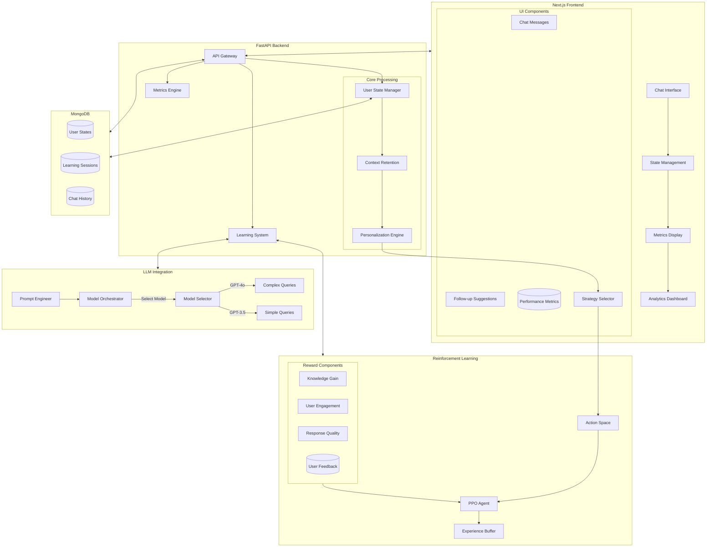
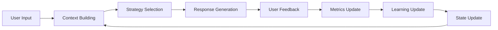
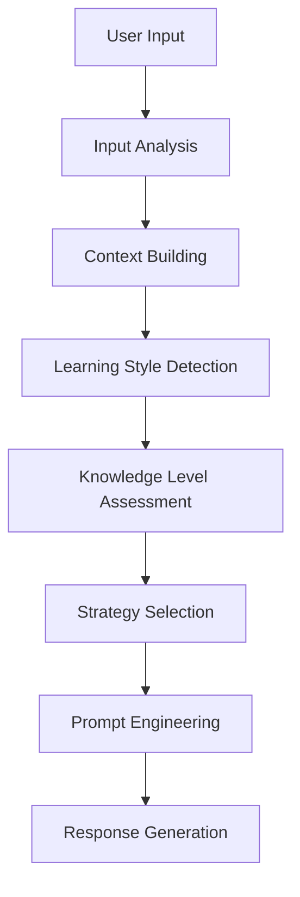
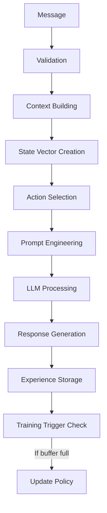
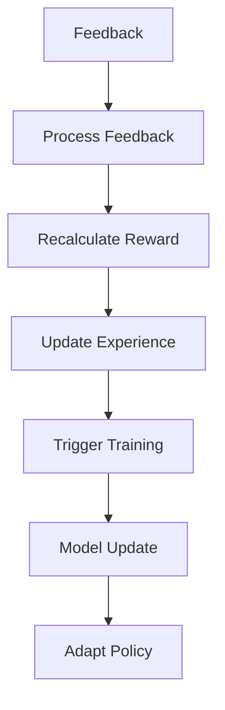

# Mioo AI Tutor V4 - Feature Documentation

## System Overview

The V4 update introduces enhanced personalization, context retention, and reinforcement learning capabilities to create a more adaptive and effective learning experience.

## Architecture Diagram



## Key Components

### 1. Enhanced User State Management
- Comprehensive user profile tracking
- Dynamic learning style adaptation
- Granular topic mastery tracking
- Engagement pattern analysis

### 2. Advanced Context Management
```python
{
    "user_profile": {
        "knowledge_level": float,
        "engagement": float,
        "interests": List[str],
        "learning_style": {
            "visual": float,
            "interactive": float,
            "theoretical": float,
            "practical": float
        }
    },
    "conversation_context": {
        "recent_topics": List[str],
        "topic_mastery": Dict[str, float],
        "context_switches": int,
        "engagement_trend": List[float]
    }
}
```

### 3. Reinforcement Learning Improvements

#### State Vector (11 dimensions)
1. Knowledge Level (0-1)
2. Engagement (0-1)
3. Performance Score (0-1)
4. Topic Mastery (0-1)
5. Feedback Ratio (0-1)
6. Learning Style - Visual (0-1)
7. Learning Style - Interactive (0-1)
8. Learning Style - Theoretical (0-1)
9. Learning Style - Practical (0-1)
10. Average Response Time (normalized)
11. Topics Coverage (normalized)

#### Enhanced Reward Function
```python
reward = (
    3.0 * knowledge_gain +
    2.0 * engagement_delta +
    1.0 * response_quality +
    0.5 * exploration_score +
    1.5 * emotional_improvement +
    2.0 * context_match
) * (1.0 + personalization_bonus + context_bonus)
```

### 4. Teaching Strategies
Five core teaching strategies with dynamic adaptation:
1. Detailed (Complex)
2. Concise (Simple)
3. Interactive (Engaging)
4. Analogy-based (Relatable)
5. Step-by-step (Progressive)

### 5. Model Orchestration
- Dynamic model selection based on:
  - Query complexity
  - User engagement
  - Context requirements
  - Performance needs

## Flow Description

### 1. Message Processing Flow
1. User sends message
2. Frontend validation
3. API gateway processing
4. Context building
5. Strategy selection
6. Model orchestration
7. Response generation
8. Metrics calculation
9. State update
10. Frontend update

### 2. Learning Cycle


### 3. Personalization Pipeline


## Key Features

### 1. Adaptive Learning
- Dynamic difficulty adjustment
- Progressive concept building
- Personalized example selection
- Context-aware explanations

### 2. Enhanced Engagement
- Follow-up suggestion system
- Interactive elements
- Progress visualization
- Real-time feedback

### 3. Metrics & Analytics
- Detailed learning progress
- Engagement trends
- Topic mastery visualization
- Strategy effectiveness

## Implementation Notes

### 1. Frontend Components
- Reactive state management
- Real-time metric updates
- Smooth animations
- Responsive design

### 2. Backend Systems
- Asynchronous processing
- Efficient caching
- Graceful error handling
- Scalable architecture

### 3. Database Optimization
- Indexed queries
- Efficient document structure
- TTL for active sessions
- Automated cleanup

### 4. RL System
- Experience replay buffer
- PPO training optimization
- Reward normalization
- Gradient clipping

## API Endpoints

| Endpoint | Method | Description |
|----------|---------|------------|
| `/chat` | POST | Process chat messages |
| `/user/{user_id}` | GET | Get user state |
| `/user/{user_id}` | PUT | Update user state |
| `/feedback` | POST | Process feedback |
| `/learning-progress/{user_id}` | GET | Get learning metrics |

## Data Models

### User State
```typescript
interface UserState {
    user_id: string;
    knowledge_level: number;
    engagement: number;
    interests: string[];
    recent_topics: string[];
    performance: number;
    chat_history: Message[];
    learning_history: LearningHistoryEntry[];
    session_metrics: SessionMetrics;
    learning_style?: LearningStyle;
    feedback_history?: Array<"like" | "dislike">;
}
```

### Learning Metrics
```typescript
interface LearningMetrics {
    knowledge_gain: number;
    engagement_level: number;
    performance_score: number;
    strategy_effectiveness: number;
    interaction_quality: number;
}
```

## Monitoring & Maintenance

### 1. Performance Metrics
- Response latency
- Model usage
- Error rates
- User engagement

### 2. System Health
- Database connections
- API availability
- Model performance
- Memory usage

### 3. User Metrics
- Learning progress
- Engagement patterns
- Feedback trends
- Strategy effectiveness

## Future Improvements

1. Enhanced Topic Detection
   - NLP-based topic extraction
   - Concept relationship mapping
   - Knowledge graph integration

2. Advanced Personalization
   - Learning path optimization
   - Dynamic content generation
   - Multimodal learning support

3. Improved RL System
   - Multi-agent learning
   - Hierarchical RL
   - Meta-learning capabilities

4. Extended Analytics
   - Predictive analytics
   - Learning pattern detection
   - Intervention recommendations

## Technical Details

### 1. Reinforcement Learning Architecture

#### 1.1 State Space Design (11 Dimensions)
```python
state_vector = [
    knowledge_level,      # Overall learning progress (0-1)
    engagement,          # Current engagement level (0-1) 
    performance,         # Task performance score (0-1)
    topic_mastery,       # Average topic mastery (0-1)
    feedback_ratio,      # Positive feedback ratio (0-1)
    learning_style[0],   # Visual learning preference (0-1)
    learning_style[1],   # Interactive learning preference (0-1)
    learning_style[2],   # Theoretical learning preference (0-1)
    learning_style[3],   # Practical learning preference (0-1)
    avg_response_time,   # Normalized response time (0-1)
    topics_covered       # Normalized topic coverage (0-1)
]
```

#### 1.2 Action Space
Five discrete teaching strategies:
```python
actions = {
    0: {
        "style": "detailed",
        "complexity": "high",
        "examples": "many"
    },
    1: {
        "style": "concise",
        "complexity": "low",
        "examples": "few"
    },
    2: {
        "style": "interactive",
        "complexity": "medium",
        "examples": "some"
    },
    3: {
        "style": "analogy-based",
        "complexity": "medium",
        "examples": "some"
    },
    4: {
        "style": "step-by-step",
        "complexity": "adjustable",
        "examples": "many"
    }
}
```

#### 1.3 PPO Architecture
```python
# Policy Network
PolicyNetwork(
    input_size=11,
    hidden_layers=[64, 32],
    output_size=5,
    activation=ReLU
)

# Value Network
ValueNetwork(
    input_size=11,
    hidden_layers=[64, 32],
    output_size=1,
    activation=ReLU
)

# Training Parameters
{
    "learning_rate": 0.001,
    "gamma": 0.99,
    "gae_lambda": 0.95,
    "clip_epsilon": 0.2,
    "value_loss_coef": 0.5,
    "entropy_coef": 0.01,
    "max_grad_norm": 0.5,
    "ppo_epochs": 10,
    "batch_size": 32
}
```

#### 1.4 Reward Function Components
```python
class RewardCalculator:
    def compute_reward(
        knowledge_gain,     # Learning progress
        engagement_delta,   # Change in engagement
        response_quality,   # Response effectiveness
        exploration_score,  # Topic exploration
        emotional_improvement,  # Emotional state change
        user_feedback=None,    # Explicit feedback
        user_state=None,       # User state
        context_match=0.0      # Context relevance
    ):
        # Base components
        knowledge_component = 3.0 * knowledge_gain
        engagement_component = 2.0 * engagement_delta
        quality_component = 1.0 * response_quality
        exploration_component = 0.5 * exploration_score
        emotional_component = 1.5 * emotional_improvement
        context_component = 2.0 * context_match

        # Bonus calculations
        personalization_bonus = calculate_personalization_bonus(user_state)
        context_bonus = calculate_context_bonus(user_state)
        feedback_multiplier = 1.2 if user_feedback == "like" else 0.8

        # Final reward calculation
        base_reward = sum([
            knowledge_component,
            engagement_component,
            quality_component,
            exploration_component,
            emotional_component,
            context_component
        ])

        return base_reward * (1.0 + personalization_bonus + context_bonus) * feedback_multiplier
```

### 2. LLM Integration Architecture

#### 2.1 Model Selection Logic
```python
class ModelSelector:
    def select_model(query_complexity: float, user_state: Dict) -> str:
        if query_complexity < 0.4 and user_state["engagement"] > 0.7:
            return "gpt-3.5-turbo"  # Faster, cheaper for engaged users
        
        if user_state["knowledge_level"] < 0.3:
            return "gpt-4o"  # More capable for struggling users
        
        return "gpt-4o"  # Default to more capable model
```

#### 2.2 Prompt Engineering System
```python
class PromptBuilder:
    def build_system_prompt(
        user_state: Dict,
        teaching_strategy: Dict,
        context: Dict
    ) -> str:
        return f"""
        ROLE: AI Tutor specialized in {teaching_strategy['style']} teaching
        
        USER PROFILE:
        - Knowledge: {describe_level(user_state['knowledge_level'])}
        - Learning Style: {user_state['learning_style']}
        - Interests: {', '.join(user_state['interests'])}
        
        TEACHING APPROACH:
        - Style: {teaching_strategy['style']}
        - Complexity: {teaching_strategy['complexity']}
        - Examples: {teaching_strategy['examples']}
        
        CONTEXT:
        - Recent Topics: {', '.join(context['recent_topics'])}
        - Current Focus: {context['current_focus']}
        - Previous Discussion: {context['last_discussion']}
        
        GUIDELINES:
        1. Match complexity to knowledge level
        2. Use examples from interests
        3. Maintain conversation continuity
        4. Adapt to learning style
        5. Build on previous context
        """
```

#### 2.3 Model Parameters
```python
MODEL_CONFIGS = {
    "gpt-4o": {
        "context_window": 128000,
        "cost_per_1k_in": 0.005,
        "cost_per_1k_out": 0.015,
        "temperature": 0.7,
        "top_p": 0.95,
        "presence_penalty": 0.6,
        "frequency_penalty": 0.5
    },
    "gpt-3.5-turbo": {
        "context_window": 16000,
        "cost_per_1k_in": 0.0010,
        "cost_per_1k_out": 0.0020,
        "temperature": 0.8,
        "top_p": 0.9,
        "presence_penalty": 0.4,
        "frequency_penalty": 0.4
    }
}
```

#### 2.4 Context Management
```python
class ContextManager:
    def build_context(
        chat_history: List[Dict],
        user_state: Dict,
        current_message: str
    ) -> Dict:
        return {
            "user_profile": extract_user_profile(user_state),
            "conversation_history": summarize_history(chat_history[-5:]),
            "current_focus": detect_focus(current_message),
            "topic_connections": find_topic_relations(chat_history),
            "learning_progress": extract_progress(user_state),
            "engagement_patterns": analyze_engagement(chat_history)
        }
```

### 3. Integration Pipeline

#### 3.1 Message Processing Flow


#### 3.2 Feedback Integration


## UI Indicators

### Progress Timeline Elements

The learning progress timeline uses different line styles and colors to represent various aspects of the learning journey:

```
timeline_indicators = {
    "knowledge": {
        "color": "bg-green-500",
        "description": "Shows overall knowledge gain",
        "range": "0-100%",
        "interpretation": {
            "0-30%": "Beginning stage",
            "31-70%": "Building understanding",
            "71-100%": "Strong grasp"
        }
    },
    "engagement": {
        "color": "bg-blue-500",
        "description": "Tracks user interaction and interest level",
        "range": "0-100%",
        "interpretation": {
            "0-30%": "Low engagement",
            "31-70%": "Moderate engagement",
            "71-100%": "High engagement"
        }
    }
}
```

#### Line Indicators:
1. **Green Line (Knowledge)**
   - Represents cumulative knowledge gain
   - Solid line indicates verified understanding
   - Increases with successful interactions and correct responses

2. **Blue Line (Engagement)**
   - Shows user engagement level
   - Updates based on interaction frequency and quality
   - Reflects participation and response patterns

#### Progress Markers:
- **Dots**: Individual learning interactions
- **Up Arrows**: Significant knowledge gains
- **Stars**: Achievement of learning milestones
- **Percentage Labels**: Numerical progress indicators

#### Status Colors:
- **Green**: Good progress
- **Yellow**: Needs attention
- **Red**: Requires intervention
- **Gray**: Inactive or not started
